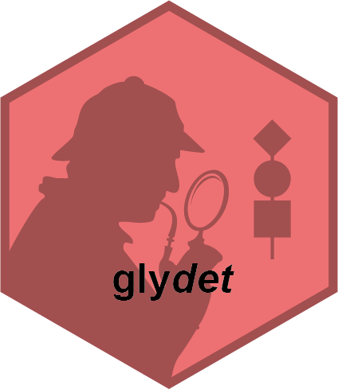

<!-- README.md is generated from README.Rmd. Please edit that file -->

```{r, include = FALSE}
knitr::opts_chunk$set(
  collapse = TRUE,
  comment = "#>",
  fig.path = "man/figures/README-",
  out.width = "100%"
)
```

# glydet <a href="https://glycoverse.github.io/glydet/"></a>

<!-- badges: start -->
[](https://lifecycle.r-lib.org/articles/stages.html#experimental)
[](https://CRAN.R-project.org/package=glydet)
[](https://github.com/glycoverse/glydet/actions/workflows/R-CMD-check.yaml)
[](https://app.codecov.io/gh/glycoverse/glydet)
<!-- badges: end -->

The goal of glydet is to describe glycosylation structural properties in a site specific manner.
In the field of glycomics, this analytical approach is known as derived traits.
glydet provides functions to calculate derived traits well-defined in literature,
and implements a domain-specific language to define custom derived traits.

## Installation

You can install the latest release of glydet from [GitHub](https://github.com/) with:

``` r
# install.packages("devtools")
devtools::install_github("glycoverse/glydet@*release")
```

Or install the development version:

``` r
devtools::install_github("glycoverse/glydet")
```

## Documentation

- 🚀 Get started: [Here](https://glycoverse.github.io/glydet/articles/glydet.html)
- 🔧 Custom derived traits: [Here](https://glycoverse.github.io/glydet/articles/custom-traits.html)
- 📚 Reference: [Here](https://glycoverse.github.io/glydet/reference/index.html)

## Role in `glycoverse`

glydet is a high-level package in the `glycoverse` ecosystem.
It is designed to be used by glycomics or glycoproteomics researchers directly to calculate derived traits.
It is built on top of many other packages in the `glycoverse` ecosystem,
including `glyexp`, `glyrepr`, `glyparse`, and `glymotif`.

## Example

First, let's load necessary packages and get the data ready.

```{r}
library(glyexp)
library(glyclean)
library(glydet)

exp <- auto_clean(real_experiment)
exp
```

Now, let's calculate some derived traits!

```{r}
trait_exp <- derive_traits(exp)
trait_exp
```

Voilà! What you see is a brand new `experiment()` object with "traitomics" type.
Think of it as your original dataset's sophisticated cousin 🎭 —
instead of tracking "quantification of each glycan on each glycosite in each sample,"
it now contains "the value of each derived trait on each glycosite in each sample."

```{r}
get_var_info(trait_exp)
```

```{r}
get_expr_mat(trait_exp)[1:5, 1:5]
```